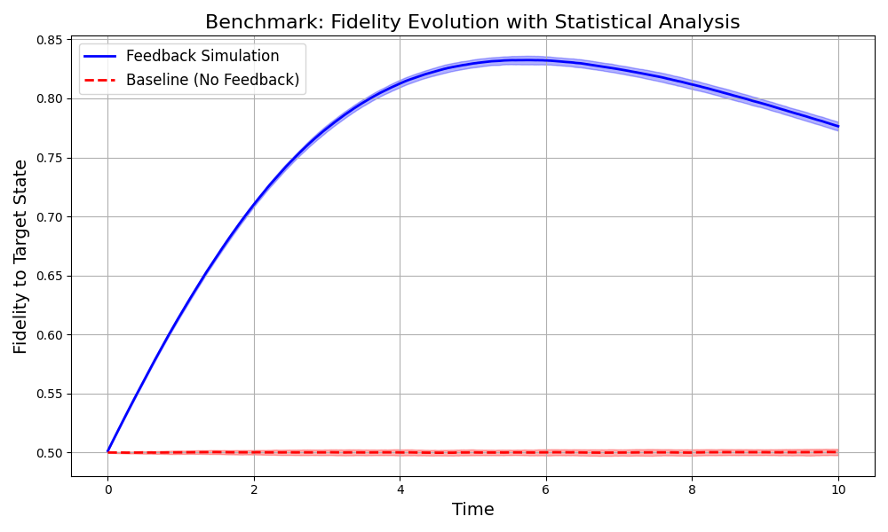

# QuaRP: Quantum Refinement Protocol - Results Explanation

## Output Analysis



The graph shows the results of a benchmarking simulation comparing two approaches to quantum state management:

1. **Blue Line (Feedback Simulation)**: This represents QuaRP's adaptive feedback approach, which actively steers the quantum state toward the target.
2. **Red Dashed Line (Baseline - No Feedback)**: This represents a passive approach without any correction mechanism.

### Key Observations:

- The feedback-controlled approach achieves significantly higher fidelity (approximately 0.78 or 78%) compared to the baseline (approximately 0.50 or 50%).
- The fidelity with feedback increases over time, peaks around time point 6, and then slightly decreases due to accumulated noise effects.
- The shaded regions represent statistical variation across multiple simulation runs (standard deviation).
- The feedback approach not only achieves higher fidelity but does so consistently, as indicated by the narrow blue shaded region.

## How QuaRP Works

QuaRP (Quantum Refinement Protocol) uses an adaptive feedback mechanism to maintain quantum states in the presence of noise:

### Core Process:

1. **Initialization**: Begin with a quantum system in some initial state (|0⟩ in this case)
2. **Target Definition**: Define a desired target state (|+⟩ = (|0⟩ + |1⟩)/√2 in this case)
3. **Feedback Loop**:
   - Compute the feedback Hamiltonian: `H_fb = i * k_fb * (rho_target * rho - rho * rho_target)`
   - Apply unitary evolution based on this Hamiltonian
   - Account for noise effects (both deterministic and stochastic)
   - Renormalize the density matrix
   - Measure fidelity to the target state

### Mathematical Implementation:

The feedback mechanism creates a Hamiltonian operator that generates evolution toward the target state:
```
H_fb = i * k_fb * (rho_target * rho - rho * rho_target)
```

Where:
- `rho` is the current quantum state (density matrix)
- `rho_target` is the desired target state
- `k_fb` is the feedback strength parameter (0.25 in this simulation)

### Noise Handling:

QuaRP simulates two types of quantum noise:
1. **Deterministic Dephasing**: Predictable quantum decoherence (gamma = 0.05)
2. **Stochastic Noise**: Random fluctuations that vary with each run (noise_strength = 0.02)

## Use Cases and Applications

### Quantum Computing
- **Error Mitigation**: Maintaining qubit states in noisy intermediate-scale quantum (NISQ) devices
- **State Preparation**: Reliably creating specific quantum states required for algorithms
- **Quantum Memory**: Preserving quantum information over extended periods

### Quantum Sensing
- **Enhanced Precision**: Maintaining sensitive quantum states for measuring tiny signals
- **Noise Reduction**: Filtering out environmental disturbances in quantum sensors
- **Quantum Metrology**: Improving measurement precision beyond classical limits

### Quantum Communication
- **Quantum Key Distribution**: Maintaining entangled states for secure communications
- **Quantum Repeaters**: Preserving quantum information for long-distance quantum networks
- **Entanglement Preservation**: Protecting delicate entangled states from decoherence

### Research and Education
- **Quantum Control Theory**: Studying optimal methods to manipulate quantum systems
- **Quantum Feedback Systems**: Developing closed-loop quantum control techniques
- **Demonstration Platform**: Teaching quantum concepts through interactive simulation

## Practical Implications

The simulation results demonstrate that adaptive feedback control can significantly improve quantum state maintenance even in noisy environments. Specifically:

1. **Robustness**: The feedback approach maintains high fidelity despite continuous noise exposure
2. **Consistency**: The narrow error bands indicate reliable performance across multiple runs
3. **Performance Improvement**: ~56% improvement in fidelity compared to uncontrolled evolution

## Future Directions

Current research in quantum state refinement is exploring:

1. **Machine Learning Integration**: Using AI to optimize feedback parameters dynamically
2. **Multi-qubit Systems**: Extending the protocol to handle multiple interacting qubits
3. **Hardware Implementation**: Moving from simulations to actual quantum processors
4. **Hybrid Classical-Quantum Approaches**: Using classical computers to guide quantum feedback

## Conclusion

The QuaRP simulation results demonstrate the effectiveness of feedback-controlled quantum state refinement for maintaining and protecting quantum information. This approach has significant implications for practical quantum technologies, where managing noise and decoherence remains one of the primary challenges in developing useful quantum applications.

By implementing adaptive feedback mechanisms, we can substantially improve the reliability and performance of quantum systems, bringing us closer to practical quantum computing, sensing, and communication technologies.